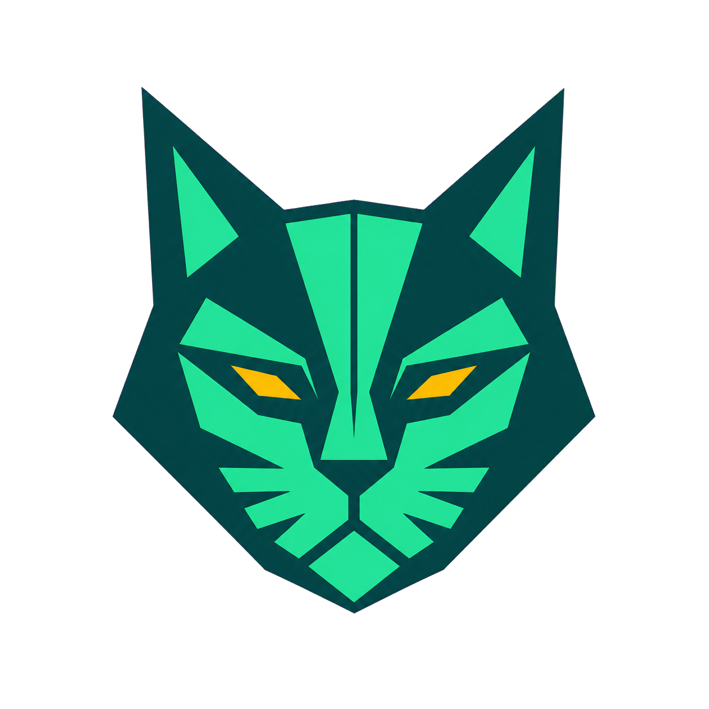
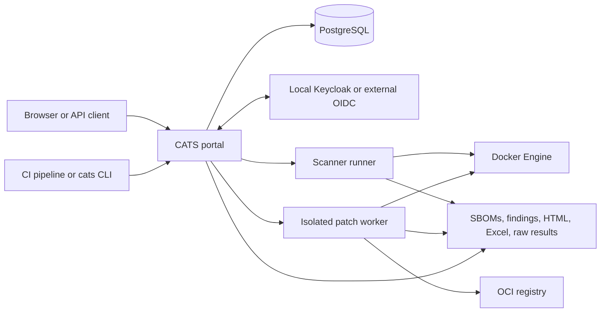

<p align="center">
  
</p>

# CATS — Continuous Assessment & Tracking System

CATS is a container-security assessment and governance platform. It discovers
the images that make up a service, generates software bills of materials
(SBOMs), finds fixable vulnerabilities and configuration issues, tracks the
resulting evidence over time, and supports controlled image remediation.

The project is designed for both connected and disconnected environments. The
release image contains the portal, scanner toolchain, patch worker, policy data,
and an offline Grype vulnerability database. PostgreSQL stores the persistent
service and governance state.

The current local release tag is **`cats:1.2.1`**.

## What CATS does

| Area | Capabilities |
| --- | --- |
| Service inventory | Creates and edits service records; tracks name, version, owner, POC, description, groups, lifecycle, images, evidence, and assessment history |
| Image assessment | Resolves image digests, creates one canonical image record, retains every workload/chart occurrence, generates SBOMs, and scans for fixable CVEs |
| Configuration assessment | Uses Trivy and Dockle for image configuration evidence, plus Trivy for Dockerfiles, Kubernetes resources, Terraform, and other supported infrastructure-as-code inputs |
| Helm discovery | Recursively discovers local, packaged, repository, and OCI chart references; renders separate chart instances with their own values and provenance; isolates chart failures |
| SBOM workspace | Generates one or several formats from a shared inventory: Syft JSON, CycloneDX JSON, CycloneDX XML, and SPDX JSON, with selectable CycloneDX versions where supported |
| Results and exports | Provides portal views, Excel exports, a self-contained offline HTML overview, raw scanner files, normalized results, and a manual-import bundle for DefectDojo |
| Governance | Applies configurable Raw or Risk Based policy, finding age, CISA KEV, EPSS, evidence-completeness, exception, mitigation, POA&M, and approval workflows |
| Architecture | Builds service architecture and data-flow views from rendered Kubernetes resources and exports the same canonical topology as SVG or workbook data |
| Remediation | Runs portal-initiated image patching with Copa, rescans the result, publishes an immutable digest, and optionally signs and verifies it with Cosign |
| Access and audit | Supports local accounts or OIDC, scoped role-based access control, audit history, trusted CAs, registry configuration, and repository policies |

## Main workflows

### Temporary Scan

The **Scan** workspace accepts public image references, local Docker image
archives, Helm URLs, and uploaded Helm archives. It performs an assessment
without creating a persistent service record.

Completed scans provide:

- An interactive results page in CATS.
- `scan-overview.html`, which works as the offline entry page after extracting
  the artifact ZIP. It links to findings, SBOMs, raw reports, logs, and the
  Excel workbook stored beside it.
- `scan-results.xlsx` for review and sharing.
- Raw Grype, Trivy, and Dockle results.
- Normalized CATS findings and service evidence.
- `results-export.tar.gz`, organized for manual DefectDojo import.

### Standalone SBOM generation

The **SBOM** workspace creates SBOMs without running vulnerability or
configuration scans. A user can select multiple output formats in one job:

- Syft JSON
- CycloneDX JSON
- CycloneDX XML
- SPDX JSON

CATS collects the underlying inventory once and serializes it into the selected
formats. The manifest records the format, specification version, generator,
generator version, timestamp, source image, digest, and checksum.

### Persistent service governance

Authenticated assessment submissions create or update a service by stable
`service.id`. A service can contain many images and retain its finding history
as image tags, digests, packages, and service versions change.

Services move through three lifecycle views:

- **Staged** — a prepared service with no ingested findings, evidence, or
  artifacts. Its first ingestion automatically makes it active.
- **Active** — a governed production service included in the default snapshot.
- **Archived** — retained historical evidence that is excluded from the active
  snapshot.

Metadata edits do not alter findings, scans, artifacts, lifecycle history, or
security state. Archive, exception, mitigation, and POA&M actions preserve
their approval and audit trails.

### Portal patching and signing

The **Patch** and **Remediations** workflows patch supported Linux container
images with Copa, scan the candidate, and make the output available for
download or registry publication. Publishing can require Cosign signing.

When signing is enabled, CATS:

1. Pushes the patched image.
2. Captures the immutable registry digest.
3. Signs that digest with the configured private key.
4. Verifies the registry signature with the configured public key.
5. Records the signing status, key fingerprint, Cosign version, and verification
   time in the result and audit history.

Signing applies only to portal-initiated patch-and-push jobs. Pipeline scans and
download-only patch jobs do not sign. See [Portal image signing](portal/SIGNING.md).

## Architecture



The canonical Compose stack contains:

- **`portal`** — FastAPI web application, API, scanner-job coordinator, service
  governance, reporting, configuration, and authentication.
- **`patch-worker`** — isolated FastAPI worker for patch, scan, publish, sign,
  and verification operations.
- **`db`** — PostgreSQL 16 for persistent portal state.
- **`keycloak`** — bundled local OIDC provider for development, evaluation, and
  disconnected deployments.

Both application services use the same versioned CATS image. Shared job volumes
carry temporary results between the portal and worker. Docker access is used to
inspect, scan, patch, and publish images.

Helm and Kubernetes architecture details are documented in
[Architecture layout](portal/docs/architecture-layout.md). The remediation
contract is documented in
[Remediation pipeline](portal/docs/remediation-pipeline.md).

## Quick start

### Requirements

- Docker Engine or Docker Desktop
- Docker Compose v2
- A locally available `cats:1.2.1` image, or access to the registry containing
  the image configured by `CATS_IMAGE`

Copy the environment template and replace every placeholder secret:

```powershell
Copy-Item .env.example .env
notepad .env
```

```bash
cp .env.example .env
${EDITOR:-vi} .env
```

Start the canonical stack from the repository root:

```text
docker compose up -d --wait
docker compose ps
docker compose logs -f portal patch-worker
```

Open **http://localhost:8080**. The Compose project is permanently named
`cats`, which prevents another stack from being created merely because
the command is run through a different path.

Routine restart:

```text
docker compose down --remove-orphans
docker compose up -d --wait
```

To deliberately erase the PostgreSQL and job volumes and start with no history:

```text
docker compose down -v --remove-orphans
docker compose up -d --wait
```

> **Warning:** `docker compose down -v` permanently deletes local CATS database
> history and job artifacts.

### Included local OIDC provider

The canonical stack always starts Keycloak with the portal. Set
`KEYCLOAK_ADMIN_PASSWORD` in `.env`, then use the normal startup command:

```text
docker compose up -d --wait
```

Keycloak is available at **http://localhost:8081** and at
`http://keycloak:8080` inside the Compose network. CATS still supports
`CATS_IDENTITY_MODE=local`, `both`, or `oidc`; use `both` while configuring and
testing the local realm so the local administrator remains available. See
[Keycloak integration](docs/KEYCLOAK-INTEGRATION.md) and
[OIDC and registry configuration](docs/oidc-and-registries.md).

## Building the release image

The scanner base and unified application image are separate build stages. The
scanner build downloads and validates the vulnerability database that will be
used when CATS runs offline.

PowerShell:

```powershell
$stamp = Get-Date -Format 'yyyyMMddHHmmss'
docker build --pull --no-cache --build-arg "GRYPE_DB_REFRESH=$stamp" -f cats-scanner/Dockerfile -t catscan-base:local cats-scanner
docker build --build-arg CATSCAN_BASE_IMAGE=catscan-base:local --build-arg CATS_VERSION=1.2.1 -f cats-image/Dockerfile.all-in-one -t cats:1.2.1 .
```

Linux:

```bash
docker build --pull --no-cache \
  --build-arg "GRYPE_DB_REFRESH=$(date -u +%Y%m%d%H%M%S)" \
  -f cats-scanner/Dockerfile -t catscan-base:local cats-scanner
docker build \
  --build-arg CATSCAN_BASE_IMAGE=catscan-base:local \
  --build-arg CATS_VERSION=1.2.1 \
  -f cats-image/Dockerfile.all-in-one -t cats:1.2.1 .
```

Save the image for disconnected transfer:

```text
docker save --output cats-1.2.1.tar cats:1.2.1
```

Load it on the destination host:

```text
docker load --input cats-1.2.1.tar
docker image inspect cats:1.2.1
```

Build details and offline-database requirements are in
[Unified image documentation](cats-image/README.md).

## CI and command-line operation

The unified image exposes a stable `cats` command for GitLab and other runners:

```text
cats version
cats prepare --source SOURCE_DIR --output PREPARED_DIR
cats evaluate --source PREPARED_DIR --output RESULTS_DIR
cats push assessment --input RESULTS_DIR/portal-result.json
cats patch --input RESULTS_DIR --output PATCH_DIR
cats push patch --input PATCH_DIR/patch-result.json
```

The scanner prepares immutable inputs, discovers and renders Helm charts,
generates SBOMs, scans them, assembles raw and normalized results, and leaves
portal delivery as an explicit authenticated step. Independent chart failures
are reported as missing evidence and do not stop the remaining chart graph.

See [Scanning pipeline documentation](scanning-main/README.md) for the evidence
contract, CI templates, inputs, and result layout.

## Result layout

Each assessment produces raw tool output and a portable normalized bundle. The
manual-import result directory follows this shape:

```text
results/
├── grype/          # Native Anchore Grype JSON
├── trivy/          # Native Trivy JSON
├── dockle/         # Native Dockle JSON
├── cats/           # CATS Generic Findings Import JSON
├── manifest.json   # File metadata and DefectDojo scan-type mapping
└── README.txt      # Manual import guidance
```

Additional job artifacts include SBOM formats and their manifest, Helm graph and
render diagnostics, canonical image and occurrence data, normalized portal
evidence, phase status files, logs, Excel workbooks, and the offline HTML
overview.

## Security model

- Local authentication and OIDC are supported. Development authentication
  bypass must remain disabled outside an isolated local environment.
- Built-in and custom roles grant functional permissions independently from
  global, group, or service scope.
- Administrative changes, evidence ingestion, lifecycle actions, approvals,
  patching, publishing, and signing are recorded in audit history.
- Registry, OIDC, signing-key, and signing-password configuration uses the
  server's `CATS_CONFIG_ENCRYPTION_KEY`. Keep this key stable and outside source
  control.
- Uploaded archives, paths, and symlinks are validated before traversal. Remote
  chart and repository access is restricted by configured policies and trusted
  certificates.
- Private signing keys are passed to the worker only for the selected job,
  written to restricted temporary files, and deleted after use.
- The Docker socket gives the portal and worker powerful access to the Docker
  host. Deploy CATS only on a dedicated, trusted host and restrict access to the
  application services.

Never commit `.env`, databases, exported image archives, scanner caches, or
private keys. The repository `.gitignore` excludes these local assets.

## Repository layout

| Path | Purpose |
| --- | --- |
| `portal/` | Portal application, patch worker, models, templates, reports, governance logic, and tests |
| `cats-image/` | Unified CATS image definition and bundled policy data |
| `cats-scanner/` | Scanner-toolchain base image and offline database validation |
| `scanning-main/` | Scanner orchestration, Helm discovery, SBOM serializers, result normalization, CLI, and thin CI wrappers |
| `docs/` | Deployment, identity, registry, certificate, and integration documentation |
| `tools/` | Local data-seeding, performance, validation, and demo-ingestion utilities |
| `compose.yaml` | Canonical PostgreSQL, portal, and patch-worker runtime |

Generated release ZIPs, Docker archives, scanner databases, handoff snapshots,
and synthetic report sets are intentionally excluded from Git. The scripts in
`tools/` recreate development fixtures when needed.

## Development and validation

Create a Python environment and install the portal dependencies:

```text
python -m venv .venv
.venv/Scripts/python -m pip install -r portal/requirements.txt -r portal/requirements-dev.txt
```

On Linux, use `.venv/bin/python` instead. Run the portal regression suite from
the repository root:

```text
.venv/Scripts/python -m pytest portal/tests -q
```

Scanner-specific Python and shell regression tests live under
`scanning-main/tests/`. Several integration tests require Docker, Helm, and the
scanner tools supplied by the CATS image.

For a populated local demonstration using ten public images:

```powershell
.\tools\ingest-real-image-services.ps1 -EnvFile .env
```

The tool submits through the normal pipeline API and stores temporary raw output
under `.demo-scan-results/`, which is excluded from Git.

## Operational notes

- CATS scans vulnerabilities with an available fix in the configured Grype
  database. Database and KEV/EPSS freshness is determined by the release build.
- Runtime scanning can operate without public update services, but referenced
  images, remote charts, and destination registries must still be reachable
  unless their inputs are supplied locally.
- Preserve the PostgreSQL volume and `CATS_CONFIG_ENCRYPTION_KEY` during upgrades.
- Upgrade the portal and patch worker together because they share the job and
  signing contracts.
- Use immutable image tags or digests for promoted deployments.
