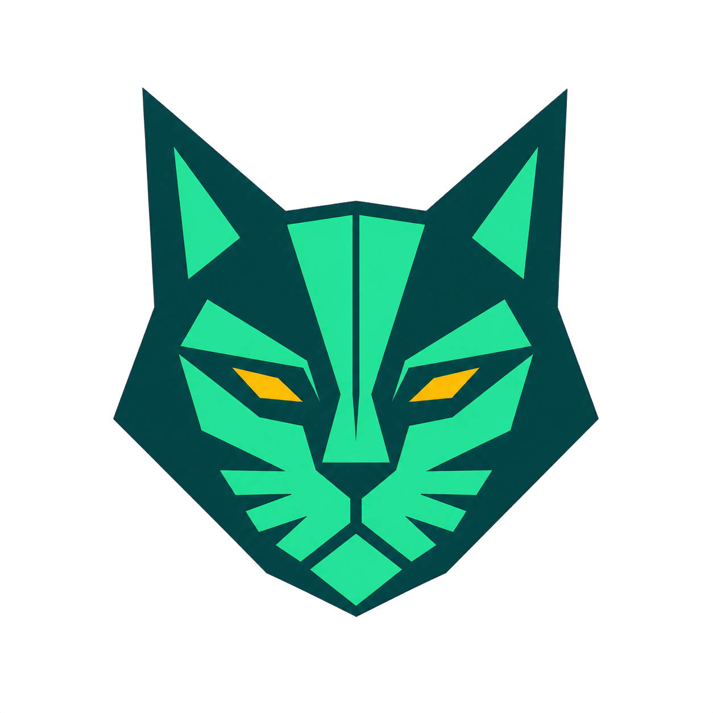
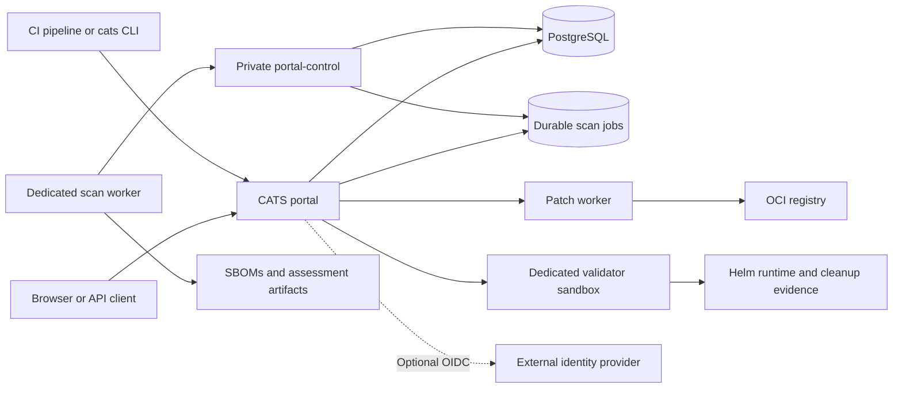

<p align="center">
  
</p>

# CATS — Continuous Assessment & Tracking System

Assess container services, retain the evidence, and manage remediation and security governance in one workspace. CATS brings image inventory, vulnerability and configuration findings, SBOMs, service architecture, approvals, and runtime validation into a shared portal.

The React interface provides service workspaces, scan results, remediation views, and administration. Docker builds compile the frontend automatically, so the UI shipped in an image comes from the checkout used for that build.

## Workspaces and capabilities

| Workspace | Purpose |
| --- | --- |
| Services | Filter the Service Security Matrix; switch Active, Staged, or Archived, choose page size, and inspect versioned service evidence. |
| Scan | Assess images, Docker image archives, and Helm inputs without creating a persistent service. |
| SBOM | Generate Syft JSON, CycloneDX JSON/XML, and SPDX JSON from a shared inventory. |
| Findings and governance | Review vulnerabilities and configuration issues; manage exceptions, mitigations, POA&Ms, and approvals. |
| Architecture | Explore topology derived from rendered Kubernetes resources and export SVG or workbook data. |
| Patch and Remediations | Patch supported Linux images with Copa, rescan candidates, download artifacts, or publish and optionally sign immutable digests. |
| Deployment Validation | Validate retained Helm artifacts in disposable kind clusters and preserve runtime evidence separately from static assessment. |
| Cybersecurity | Investigate scoped posture, trends, missing evidence, and top service/CVE/package contributors through clickable metrics. |
| Administration | Configure accounts, OIDC, access, registries, trust, validators, signing, and security data sources. |

Scan downloads include an offline HTML overview, an Excel workbook, SBOMs, raw scanner reports, normalized findings, and a manual DefectDojo import bundle. Connected and disconnected workflows are supported when their required images, charts, databases, and tools are available.

## Role training

The [training library](docs/training/README.md) contains real application screenshots and practical guides for every built-in role:

- [Administrator](docs/training/administrator.md): accounts, configuration, validators, signing, and deletion.
- [Assessor](docs/training/assessor.md): evidence review and standard exports.
- [Service Manager](docs/training/service-manager.md): service maintenance, scan ingestion, requests, and remediation.
- [Cybersecurity](docs/training/cybersecurity.md): posture investigation, independent reviews, and security policy.

Assignments can be global, group-scoped, or service-scoped, and permissions combine. The built-in Administrator role excludes `scan.ingest`; an additional suitable grant is needed to retain scans. Temporary public scans are distinct from governed service evidence.

## Install and start

The main stack contains **portal**, **portal-control**, **scan-worker**, **patch-worker**, and **PostgreSQL**. Portal, its private control listener, and both workers use the same CATS image. Local accounts are the default; an external OIDC provider is optional. CATS does not deploy Keycloak or another identity provider.

You need Docker Engine or Docker Desktop running Linux containers, Docker Compose v2, and a built CATS image. Run the following from the repository root.

### 1. Configure your environment

For a new installation on Windows:

```powershell
Copy-Item .env.example .env
notepad .env
```

On Linux:

```sh
cp .env.example .env
${EDITOR:-vi} .env
```

Replace the database and bootstrap passwords, pipeline and worker tokens, encryption-key placeholder, and prepared-release path. Set `CATS_IMAGE` to your exact image tag. **For an existing installation, update your current environment file instead of replacing it.** Preserve the database volume and encryption key.

Generate the Fernet key using a Python environment with the portal dependencies:

```sh
python -c "from cryptography.fernet import Fernet; print(Fernet.generate_key().decode())"
```

| Setting | Meaning |
| --- | --- |
| `CATS_IMAGE` | Image used by portal, portal-control, and both workers, for example `cats:1.3`. |
| `CATS_SCAN_WORKER_TOKEN` | Unique random token of at least 32 characters shared with the private control listener; replace the example placeholder. |
| `CATS_SCAN_REGISTRY_AUTH_SOURCE` | Existing registry-auth directory; defaults to `./scan-registry-auth`. |
| `CATS_PORT` | Browser-facing port; defaults to `8080`. |
| `CATS_BOOTSTRAP_USERNAME` / `CATS_BOOTSTRAP_PASSWORD` | Initial local administrator credentials. |
| `CATS_CONFIG_ENCRYPTION_KEY` | Stable key for stored secrets; retain it across upgrades. |
| `CATS_MANAGED_VALIDATOR_RELEASE_SOURCE` | Host directory of the prepared validator release, mounted read-only. Use an absolute path in deployment templates. |
| `CATS_IDENTITY_MODE` | `local`, `both`, or `oidc`; external OIDC fields start blank. |
| `CATS_DEV_AUTH_BYPASS` | Defaults to `false`; enable only deliberately for isolated development. |
| `SESSION_COOKIE_SECURE` | Set to `true` when serving the portal over HTTPS. |

### 2. Build or load the image

**Windows rebuild:** open your repository build shortcut or run:

```powershell
.\build.bat
```

Enter the version you want to build. The utility builds the scanner base and CATS image, prepares verified validator image archives, recreates portal, portal-control, patch-worker, and scan-worker, and verifies the deployed image identities. It uses the **current checkout**, including the current UI. Docker must be running. The versioned image selection applies to that rebuild; update `CATS_IMAGE` in your environment file for future Compose runs.

**Connected release build without deployment:**

```sh
python scripts/build-cats-release.py --cats-version 1.3 --tag cats:1.3
```

This builds the unified runtime, acquires the configured Kind image when needed, and prepares a Docker-host validator release. Set `CATS_MANAGED_VALIDATOR_RELEASE_SOURCE` to the directory printed at completion. `--profile runtime` skips release preparation; use it only when you already have the required release inputs. See [release inputs](docs/managed-validator-release-inputs.md) for the full contract.

**Image transfer to a disconnected host:**

```sh
docker save --output cats-1.3.tar cats:1.3
docker load --input cats-1.3.tar
```

Also transfer PostgreSQL and required validator/node image archives or release inputs. Exporting the CATS image alone does not export the database, runtime volumes, or mounted release directory.

### 3. Start and verify

Before starting, ensure the directory selected by `CATS_SCAN_REGISTRY_AUTH_SOURCE` exists (an empty directory is sufficient without registry credentials). The Windows build utility prepares the default directory. Keep port 8001 private.

If you loaded or built the image without using the Windows deployment utility:

```sh
docker compose config --quiet
docker compose up -d --wait
docker compose ps
```

Open **http://localhost:8080** (or your configured port) and sign in with your local account. The project name is `cats`, so root and main-template deployments refer to the same stack.

```sh
docker compose logs -f portal portal-control scan-worker patch-worker
```

For upgrades, select the new `CATS_IMAGE` and run `docker compose up -d --force-recreate --wait portal portal-control scan-worker patch-worker`. This preserves named volumes. `docker compose down` stops the stack; adding `--volumes` deletes persistent data.

Before production use, complete the [scan-worker target-host acceptance checks](docs/dedicated-scan-worker.md). The [architecture review](docs/scan-worker-architecture-review-2026-10-09.md) records measured results, existing test failures, and deployment validation still required. Rebuild the image and update Compose together.

## Deployment templates

| Files | Use |
| --- | --- |
| `compose.yaml` + `.env.example` | Repository-root runtime and Windows rebuild utility. |
| `templates/compose.main.yaml` + `templates/main.env.example` | Deployment with an explicitly selected image and absolute prepared-release path. |
| `compose.validator.yml` | Source-built validator on a dedicated Linux amd64 sandbox. |
| `templates/compose.validator.yaml` + `templates/validator.env.example` | Matching validator deployment template and trust settings. |
| `portal/.env.example` | Reference for direct portal development; the root Compose setup uses `.env.example`. |

Follow [template setup](templates/README.md) for commands, file locations, TLS inputs, and the separate validator environment. Real `.env` files and private keys stay outside Git.

## Runtime layout and trust


```mermaid
flowchart LR
    Browser[Browser or API client] --> Portal[CATS portal]
    Pipeline[CI pipeline or cats CLI] --> Portal
    Portal --> DB[(PostgreSQL)]
    Portal --> Queue[(Durable scan jobs)]
    Control[Private portal-control] --> Queue
    Scanner[Dedicated scan worker] --> Control
    Control --> DB
    Portal --> Worker[Patch worker]
    Portal --> Validator[Dedicated validator sandbox]
    Portal -. Optional OIDC .-> Identity[External identity provider]
    Scanner --> Evidence[SBOMs and assessment artifacts]
    Worker --> Registry[OCI registry]
    Validator --> Runtime[Helm runtime and cleanup evidence]
```

The patch-worker has Docker-host access. The scan-worker has no Docker socket or database credentials; it exchanges jobs and evidence through the private control listener. The validator uses host networking and the Docker socket on a dedicated sandbox VM; it must not share a production host. Its validation API uses mTLS, while its administrator interface uses HTTPS. Restrict both interfaces to their intended networks.

Use an HTTPS reverse proxy for shared deployments, keep development bypass disabled, and retain access/audit controls. Configure private registries, trusted CAs, and signing through administration. Signing records the published digest and verification evidence; it does not replace vulnerability or runtime assessment.

Simplified service findings group vulnerabilities by CVE, whereas scan totals may count individual observations. Cybersecurity warning policy can turn a compliant service yellow without changing the underlying compliance decision. Missing evidence matters even when no vulnerabilities are shown.

Remediation is disabled until enabled in administration. Patch, publication, signature verification, and runtime validation have separate outcomes. Downloaded candidates are not proof of runtime success; reassess and ingest authoritative evidence after deployment.

Permanent service deletion requires global `service.delete`, a reason, and exact `delete <service name>` confirmation. Active jobs block deletion. CATS removes its service records and associated local outputs, retains audit history, and does not remove external registry images.

Offline operation requires locally supplied inputs and usable scanner databases. Security-source freshness and missing evidence remain part of the assessment. See [cybersecurity and validation](docs/cybersecurity-and-validation.md) and [disconnected delivery limits](docs/schrodinger-deliveries.md).

## Guides

- [Service remediation](docs/remediation.md) and [remediation pipeline](portal/docs/remediation-pipeline.md)
- [Deployment Validation](portal/docs/deployment-validation.md)
- [Validator appliance](docs/validator-appliance.md) and [managed validator acceptance](docs/managed-validator-completion-report.md)
- [Signing](portal/SIGNING.md)
- [OIDC integration](docs/KEYCLOAK-INTEGRATION.md)
- [Trusted CAs and repository policies](docs/trusted-ca-and-repository-policies.md)
- [Architecture layout](portal/docs/architecture-layout.md)
- [Standalone scanner](cats-image/STANDALONE-SCAN.md)
- [React frontend development](docs/react-frontend.md)

## Development and checks

Create the backend environment from the repository root:

```powershell
python -m venv .venv
.venv/Scripts/python -m pip install -r portal/requirements.txt -r portal/requirements-dev.txt
$env:PYTHONPATH = "$PWD;$PWD/portal"
.venv/Scripts/python -m pytest portal/tests -q
```

On Linux, use `.venv/bin/python` and `PYTHONPATH=.:portal`. Some integration checks require Docker, Helm, or scanner tools.

For the React frontend, use the tool versions pinned by the Dockerfile and package manifest:

```sh
cd portal/frontend
pnpm install --frozen-lockfile
pnpm typecheck
pnpm test
pnpm build
```

Build frontend assets before launching the Python portal directly; container builds already do so. Keep PostgreSQL state, the encryption key, and required release inputs through upgrades, and upgrade portal and worker together.
