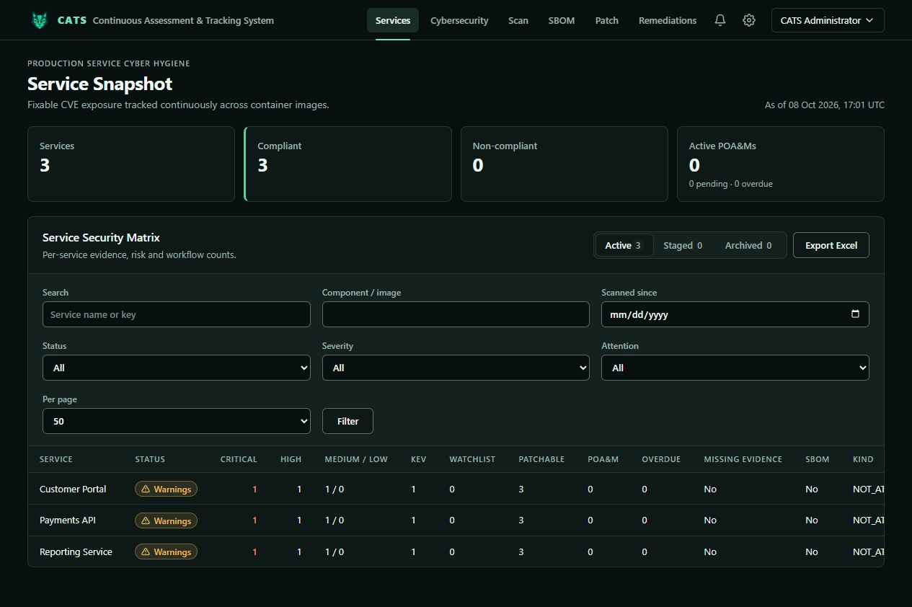

# CATS role training

| Built-in role | Guide |
| --- | --- |
| Administrator | [Configure and administer CATS](administrator.md) |
| Assessor | [Review evidence and export assessments](assessor.md) |
| Service Manager | [Maintain services and execute workflows](service-manager.md) |
| Cybersecurity | [Investigate posture and review governance](cybersecurity.md) |

## Getting started

Sign in at your organization's CATS URL using its local or OIDC account. Change an initial password when prompted. Ask an administrator to confirm your role and scope if an expected action is absent. Use training services for exercises.

Open **Services**, choose Active, Staged, or Archived, filter the Service Security Matrix, choose **Per page**, and open a service. Select the version being assessed before interpreting its evidence. The Services card reports the service total independently of page size.

## Permission reference

These are built-in defaults; custom roles and combined assignments can change effective access.

| Capability | Administrator | Assessor | Service Manager | Cybersecurity |
| --- | --- | --- | --- | --- |
| View services and standard exports | Yes | Yes | Yes | Yes |
| Edit services; request exception, POA&M, archive | Yes | No | Yes | Yes |
| Review requests; revoke exceptions | Yes | No | No | Yes |
| Ingest scan evidence | Additional grant needed | No | Yes | Yes |
| Execute remediation | Yes | No | Yes | Yes |
| Manage validators and signing | Yes | No | No | Yes |
| View audit records | Yes | Yes | No | Yes |
| Configure policy | Yes | No | No | Within authorized scope |
| Manage accounts/roles; permanently delete service | Globally | No | No | No |

Global assignments cover all services; group and service assignments limit access accordingly. Global configuration needs a global configuration grant. A service assignment does not grant group administration. Account, role, and permanent-delete permissions require global access. Requesters cannot approve or reject their own requests, even with a reviewer role. Standard exports do not grant every portable-bundle, inventory, metadata, or template-management permission.

## Screenshot provenance

The twelve screenshots were captured on **8 October 2026**, from application revision **ce9ee0e**, using an isolated loopback instance, in-memory database, and four single-role accounts. All displayed services, findings, CVEs, accounts, and endpoints are synthetic. These are live application captures, not mockups or real vulnerability intelligence.

Capture covered pages and dialogs. It did not execute actual scans, registry publication, signing, validator provisioning, or deletion. Those operations require real deployment prerequisites. Your data, enabled capabilities, and available actions may differ.

Return to the [repository README](../../README.md) for installation, build commands, and deployment templates.
