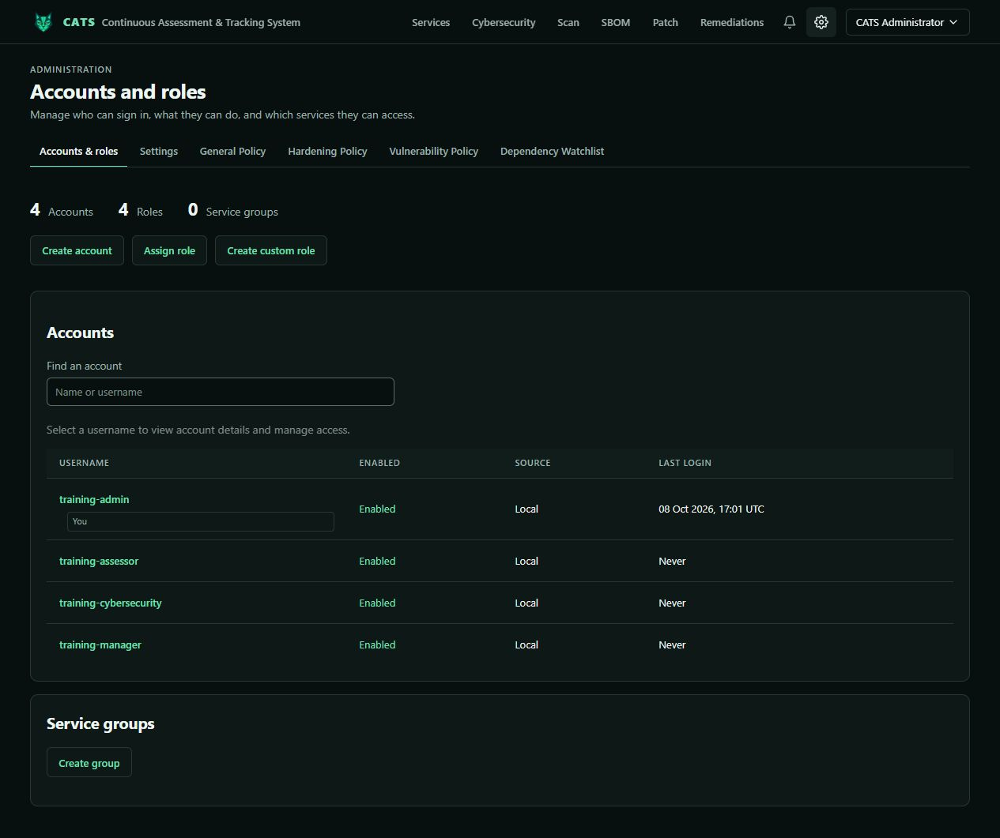
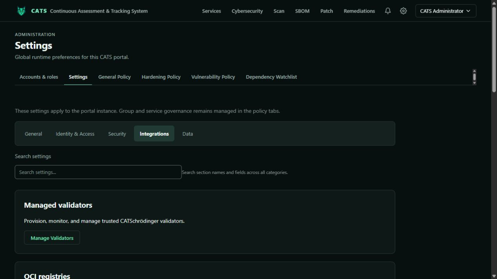
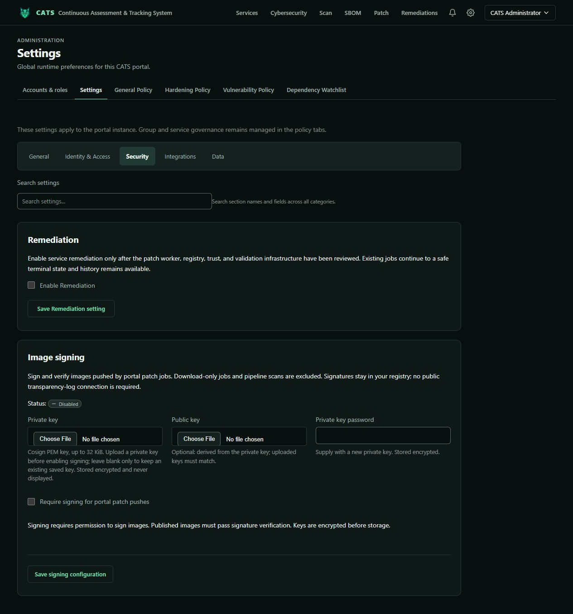
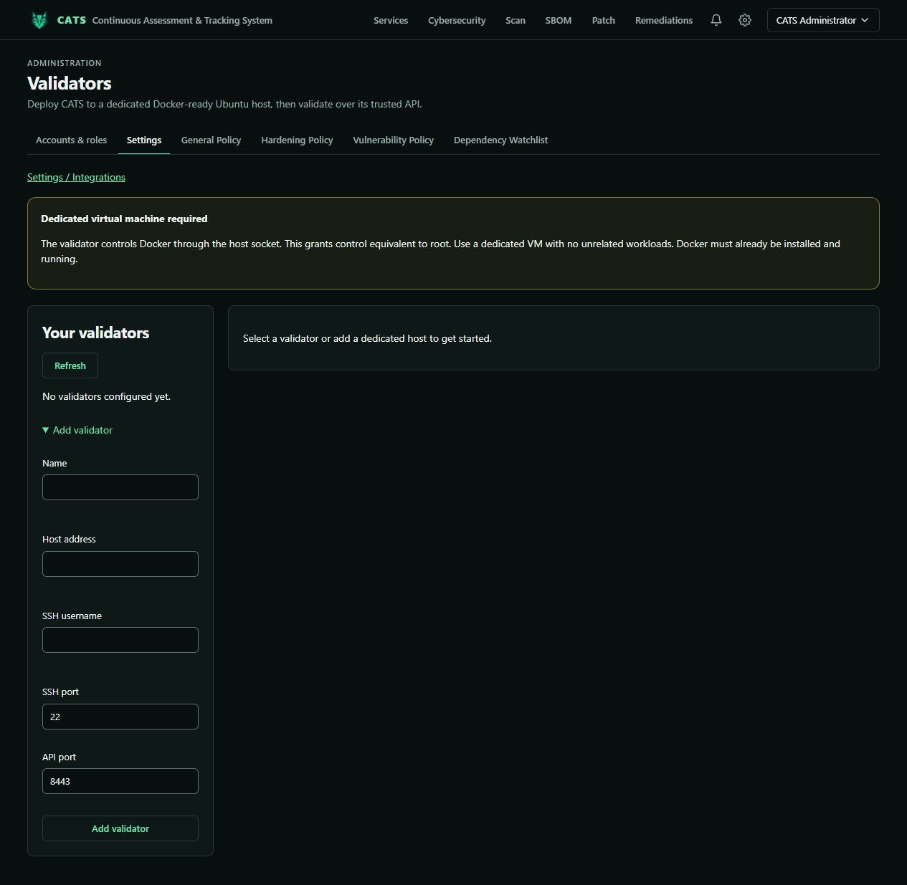

# Administrator training

[Training index](README.md) · [Installation](../../README.md)

Administrators manage accounts, roles, configuration, governance, validators, signing, and permanent service deletion. The built-in role excludes `scan.ingest`; add an appropriate role/grant when scan retention is needed. Administrator access does not bypass independent review.

## Accounts and identity

Open **Administration → Accounts & roles**, create accounts, and assign built-in/custom roles with deliberate global, group, or service scope. Permissions combine across assignments. Accounts/roles and permanent deletion require global authority.

Only Service Manager assignments support combined service/group selection; the selected service must belong to that group. Keep reviewers separate from requesters. Use custom roles for the actual required permissions.

Configure external identity through Identity settings and the [OIDC guide](../KEYCLOAK-INTEGRATION.md). Claim mappings grant existing CATS roles for validated claim values within selected scopes. Unmatched values grant no mapped OIDC role; local assignments remain separate. Use the mapping table and scope selectors for this installation.

## Settings and policy

Settings categories include General, Identity, Access, Security, Integrations, and Data. Search settings to locate controls. General Policy contains workflow timing, exception limits, warning policy, evidence handling, audit configuration, and export templates. Hardening Policy, Vulnerability Policy, and Dependency Watchlist control their respective security decisions.

Incomplete evidence is not proof of resolved findings. Test policy changes against a training service and review accessible audit activity. See [Cybersecurity training](cybersecurity.md).

## Registries and trusted CAs

Open **Settings → Integrations**. Configure OCI endpoints, repository/project prefixes, and supported credentials for scan/patch jobs. Upload public PEM root/intermediate CA certificates when internal TLS endpoints require them; never put private keys in the CA field.

Repair TLS trust at the component connecting to the endpoint instead of hiding the error by disabling verification. Review endpoint and repository policy. See [CA and repository configuration](../trusted-ca-and-repository-policies.md).

## Image signing and remediation

Open **Settings → Security → Image signing**:

1. Obtain a Cosign PEM key pair through your key-handling process.
2. Upload the private key (maximum 32 KiB) and its password when needed. Public key upload is optional because it can be derived; an uploaded public key must match.
3. Select **Require signing for portal patch pushes** and save only after supplying usable keys.
4. Verify a controlled publication and its signature result before production use.

Signing applies to portal patch/remediation pushes, not downloads or pipeline scans. Signatures stay in the registry; public transparency-log access is not required. Required-signing publication succeeds after verification of the immutable digest.

Preserve `CATS_CONFIG_ENCRYPTION_KEY` across upgrades and share the correct value with portal/worker. Stored keys/secrets are encrypted. If keys cannot be loaded, verify encryption-key continuity and key/password pairing; restore correct configuration or re-upload valid keys. See [signing reference](../../portal/SIGNING.md).

Remediation enablement is a separate Security control. Configure its worker/registry prerequisites and inspect patch, publication, signing, and runtime results separately.

## Managed validators

Use a dedicated supported sandbox host. Docker-host access is root-equivalent; do not share a production workload host. Follow [validator setup](../validator-appliance.md) and [release inputs](../managed-validator-release-inputs.md).

1. Open **Manage Validators → Add validator**. Enter name, host, SSH username/port, and API port.
2. Discover the SSH fingerprint and confirm it through an independent trusted channel.
3. Run readiness checks; inspect platform, runtime, resources, and warnings.
4. Use the compatible payload/release workflow offered by your deployment. Payload construction requires complete trusted packaged assets; Docker-host releases require verified local inputs. Supply missing assets through the supported build/release process.
5. Provision, then inspect operation results, connectivity, self-test, and cleanup evidence.
6. Manage certificate rotation and supported upgrades; investigate failed cleanup before reusing the host.

Registration and readiness are not successful validation. A release without required managed-validator assets cannot build the corresponding payload. Offline deployment needs archives/manifests/hashes and runtime/node inputs in addition to the CATS image. Missing assets are not implicitly downloaded at runtime.

## Permanent service deletion

On service **Actions → Delete service**, give a reason of at least three characters and type the exact phrase `delete <service name>`, replacing the placeholder with its display name. Active jobs block deletion. This removes CATS service records and associated local patch/remediation outputs, preserves audit history, and does not remove remote registry images.

Global `service.delete` authorizes this operation. The legacy `ALLOW_SERVICE_DELETE` variable is not its authorization gate. Built-in Cybersecurity and Service Manager roles do not grant permanent deletion.

## Deployment maintenance

Preserve PostgreSQL volumes, retained artifacts, and the encryption key. Upgrade portal, portal-control, scan-worker, and patch-worker together with the same image tag and matching Compose configuration. Complete the [scan-worker acceptance checks](../dedicated-scan-worker.md) on the deployment host. Enable secure cookies for HTTPS and keep development bypass disabled in shared deployments. Back up persistent data and required release assets. Exporting an image does not export database volumes or separately mounted release inputs.

See [deployment templates](../../templates/README.md), [runtime validation](../../portal/docs/deployment-validation.md), and [remediation pipeline](../../portal/docs/remediation-pipeline.md).

## Exercise

Explain a scoped role assignment, locate registry/CA/signing controls, identify encryption-key recovery requirements, and describe validator readiness. Explain deletion safeguards without deleting a real service.
