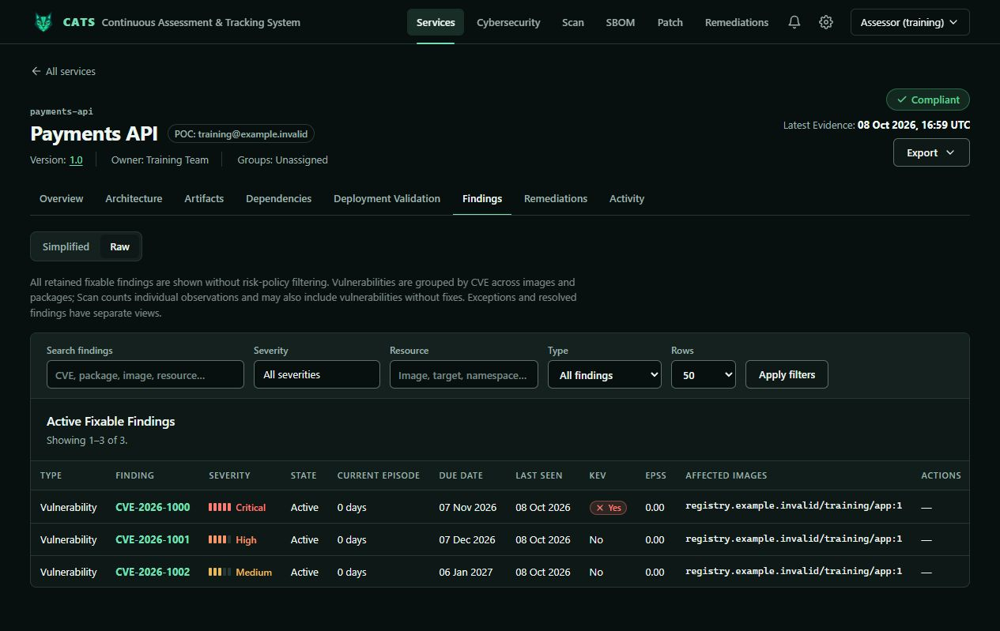
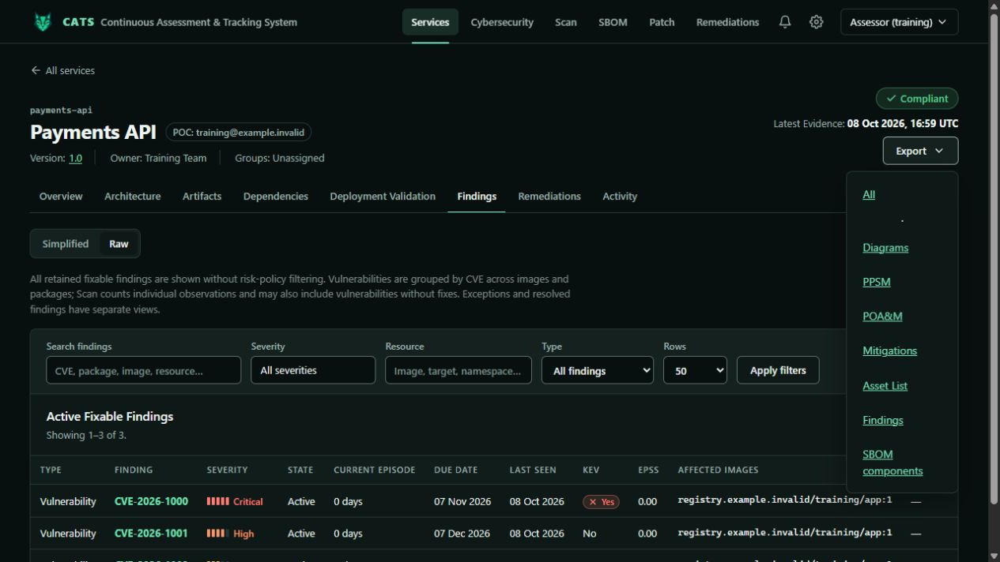

# Assessor training

[Training index](README.md)

The Assessor role provides scoped service viewing, standard exports, and audit viewing. It does not edit services, ingest evidence, submit governance requests, execute remediation, or configure the system.

## Review evidence

1. Open **Services**, choose the lifecycle, and filter by name, component, scan date, posture, severity, or attention.
2. Open a service and select the version under assessment. Confirm its owner and latest scan.
3. Use Overview, Architecture, Artifacts, Dependencies, Deployment Validation, Findings, Remediations, and Activity to trace available evidence.
4. On **Findings**, use search, severity, resource type, and row-count controls.

**Simplified** groups vulnerabilities by CVE across images/packages; **Raw** shows underlying observations. Scan totals may include observations without fixes and therefore differ from retained fixable findings. Check affected image/package, installed/fixed versions, severity, and source evidence. Review exceptions and resolved findings separately. An exception is not proof of a software fix; missing SBOM or runtime evidence is not proof of safety.

## Export and report

Open **Export** and choose Diagrams, PPSM, POA&M, Mitigations, Asset List, Findings, or SBOM components. **All** downloads these individual exports together in one ZIP, including the Portable Service Bundle when you have its separate permission. PPSM, POA&M, and Asset List use the configured export templates, including applicable group overrides. Missing diagram or SBOM evidence is explained in a text file inside the ZIP. Click outside the menu or press Escape to close it.

The screenshot below shows the earlier menu appearance; the current menu includes file-format badges and the combined ZIP download.

Check the service/version in the output before sharing. Specialized exports may require separate permissions. Review accessible audit records to establish who performed governed actions and when. Send the owner the CVE, affected component, evidence version, and required follow-up through your organization's process.

## Exercise

Find a Critical issue on a training service, compare simplified/raw evidence, identify a suitable export, and explain whether SBOM and deployment-validation evidence are present. Separate observed findings, accepted exceptions, and missing evidence in your assessment.
