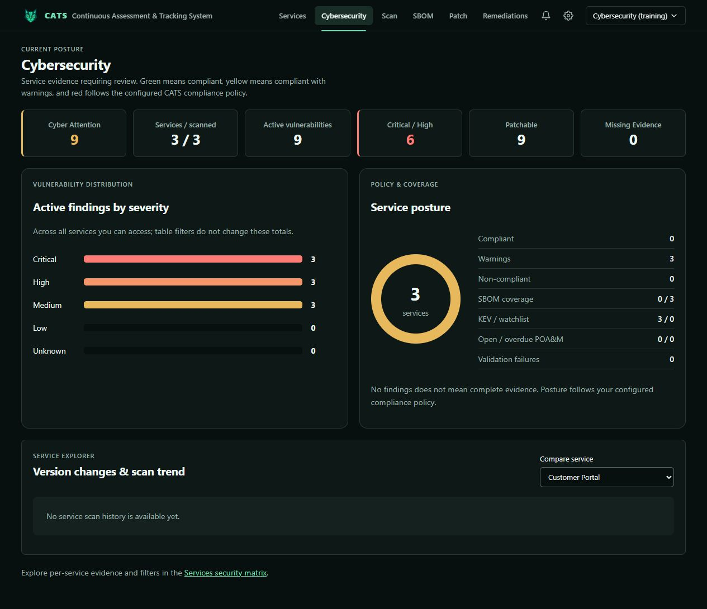
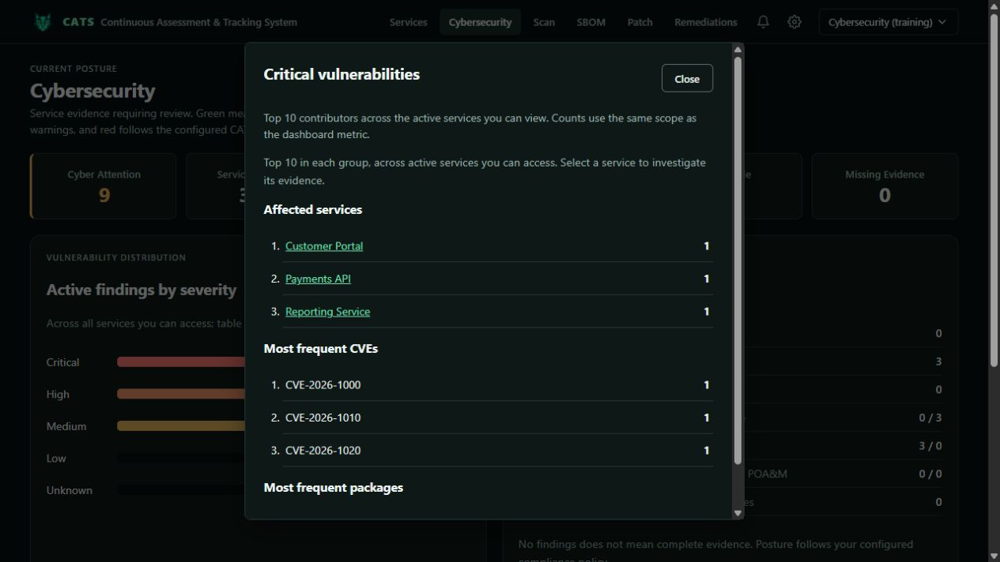
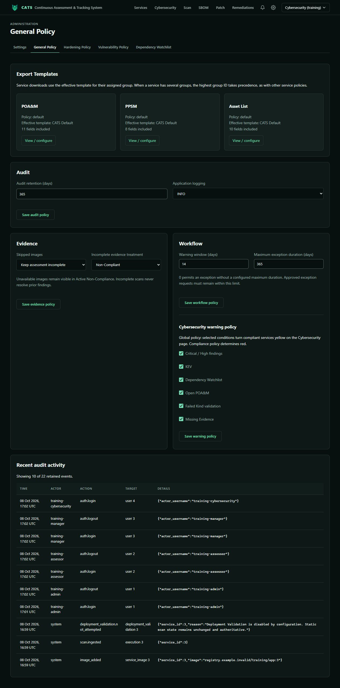

# Cybersecurity training

[Training index](README.md) · [Service workflows](service-manager.md)

Cybersecurity can review/edit scoped services, ingest scans, execute remediation, review governance, remove evidence, restore archived services, view audit records, configure security policy, and manage validators/signing. The built-in role excludes accounts/roles, permanent service deletion, and some specialized administrative exports.

## Investigate dashboard metrics

Open **Cybersecurity**. Review attention, services/scanned, active vulnerabilities, Critical/High, patchable findings, and missing evidence. Dashboard totals cover accessible active services; table filters do not redefine those totals.

Click a metric, severity bar, or supported posture item. **Critical** shows top affected services, frequent CVEs, and packages. Open a contributor and inspect its retained service evidence before assigning work.

Green follows compliance policy; yellow marks selected warnings on an otherwise compliant service; red follows non-compliance. Zero vulnerabilities does not establish complete evidence. Review SBOM coverage, KEV/watchlist matches, open/overdue POA&Ms, missing evidence, and validation failures. Use trends/comparison when history exists and the service matrix link for detailed filtering.

## Review independently

Review pending exception, POA&M, and archive requests against evidence, justification, controls, expiry, and scope. Rejecting a request requires a reason. You cannot approve or reject your own request; route it to another authorized reviewer. Revisit active exceptions and revoke when no longer justified. Close active POA&Ms only with supporting evidence. Evidence removal is distinct from permanently deleting a service.

## Configure policy

In **General Policy → Workflow**, configure warning timing, exception limits, and **Cybersecurity warning policy**. Available warning conditions include Critical/High, KEV, Dependency Watchlist, open POA&M, failed Kind validation, and missing evidence. Save the intended configuration.

Warning policy does not resolve findings or rewrite compliance decisions. Global configuration requires a global grant; group grants only authorize matching group configuration where supported. Export-template management uses dedicated permissions. Use Vulnerability Policy, Hardening Policy, and Dependency Watchlist for their respective decisions; verify affected service evidence after changes.

For validator, registry, CA, and signing prerequisites, follow the [Administrator configuration guide](administrator.md). Preserve independent host-fingerprint verification and inspect cleanup evidence. Signing requires a usable key, stable server encryption key, and successful verification of the published digest.

## Exercise

Investigate a Critical metric, identify a service/package contributor, and explain warning versus compliance state. Review another user's request and describe how a policy change should be validated against retained evidence.
