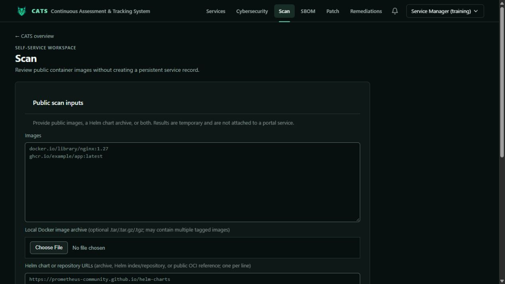
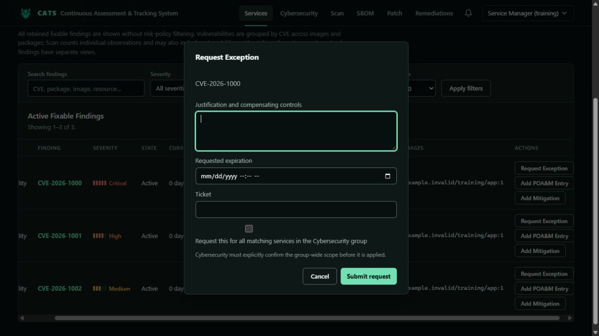

# Service Manager training

[Training index](README.md) · [Evidence review](assessor.md)

Service Managers can view/export and edit assigned services, ingest scans, request exceptions, POA&Ms and archiving, and execute remediation. The built-in role cannot review requests, administer system policy, remove evidence, restore archived services, or permanently delete services.

## Maintain and scan a service

Open an assigned service, select its version, and keep its information, owner, and contact details current. Review retained artifacts and findings before starting work.

On **Scan**, supply supported image references, Docker image archives, Helm inputs, or service-definition YAML. For retained evidence, choose **Ingest completed scan into** and an authorized service/version before running the scan. Inspect skipped inputs and completeness afterward.

The default **Do not ingest (temporary)** creates a public-tool result rather than governed service evidence. Ingestion requires `scan.ingest` and service scope. Private registries and TLS trust need configuration from an authorized administrator. Incomplete scans must not resolve old findings. A service alias can differ from the actual Helm chart package name; chart identity/version must still match its source.

## Request governance decisions

From **Findings**, use **Request Exception**, **Add POA&M Entry**, or the mitigation workflow. Explain justification, affected component, compensating controls, expiry, and tracking reference as applicable.

Check service versus group scope before submission. Group-wide exception requests require explicit confirmation and suitable scope. Configured workflow policy limits expiry. An independent Administrator or Cybersecurity reviewer must decide the request; requesters cannot approve or reject their own requests.

Keep POA&M progress and mitigation evidence current. Closure applies to an active POA&M. Request archiving when a service leaves use; restoration and deletion require other permissions.

## Remediate and validate

Remediation must be enabled in administration. Inspect the source-bound plan, use Automated or Guided handling, and resolve ambiguous image mappings explicitly. Confirm registry destination and delivery mode before execution.

Review candidate patch/post-scan evidence, publication, required signature verification, and runtime validation separately. Download-only delivery is not runtime verification. Delivery retries can reuse the remediation revision. Deploy through your organization's process, then scan and ingest authoritative evidence for the deployed version; candidate evidence does not silently replace original governance records.

See [service remediation](../remediation.md) and [pipeline details](../../portal/docs/remediation-pipeline.md).

## Exercise

Select a training ingestion target, draft a justified exception request, and identify the independent reviewer. Explain what evidence is needed after remediation to establish successful deployment.
